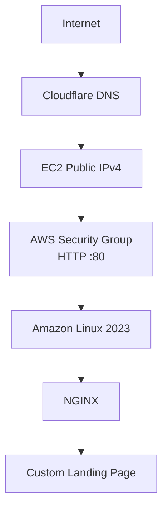

# 🌐 Deploying an NGINX Web Server on AWS EC2

   

Deploying an NGINX web server on **AWS EC2**, configuring **Cloudflare DNS**, and making it publicly accessible using my own custom domain.

------------------------------------------------------------------------

# 📖 Overview

This project brought together a lot of the networking concepts I'd been learning separately. It was my first time registering my own domain, deploying a web server on AWS, and pointing that domain to an EC2 instance using Cloudflare DNS.

I was expecting this project to be much more difficult than it actually was, but once I broke it down into smaller steps, everything started to
make sense. Seeing all the networking components working together made the theory click.

**By the end of this project I had successfully:**

-   Registered my own domain (**alexandravladu.co.uk**)
-   Launched an Amazon EC2 instance running Amazon Linux 2023
-   Installed and configured NGINX
-   Configured AWS Security Groups
-   Connected my custom domain using Cloudflare DNS
-   Customised the default NGINX landing page
-   Verified that the website was accessible using both the EC2 public
    IP address and my custom domain

------------------------------------------------------------------------

# 🛠️ Skills Demonstrated

-   Provisioning cloud infrastructure with AWS EC2
-   Linux server administration
-   Installing and managing system services
-   Configuring AWS Security Groups
-   DNS management using Cloudflare
-   Deploying a web server with NGINX
-   Basic networking troubleshooting
-   Editing and serving static web content

------------------------------------------------------------------------
# 🌐 Architecture


------------------------------------------------------------------------

# 💻 Technologies Used

| Technology | Purpose |
|------------|---------|
| AWS EC2 | Cloud Virtual Machine |
| Amazon Linux 2023 | Operating System |
| NGINX | Web Server |
| Cloudflare DNS | DNS Management |
| HTTP | Serving Web Pages |
| EC2 Instance Connect | Browser-based access to the server |

------------------------------------------------------------------------

# 🎯 Project Objectives

-   Launch an Amazon Linux EC2 instance
-   Install and configure NGINX
-   Configure AWS Security Groups
-   Register a custom domain
-   Create an A record in Cloudflare
-   Verify public access using both the EC2 public IP address and the
    custom domain

------------------------------------------------------------------------

# 🚀 Deployment Steps

## 1. Launch an EC2 Instance

I launched an **Amazon Linux 2023** EC2 instance using the **t3.micro** instance type.

Instead of setting up SSH locally, I decided to use **EC2 Instance Connect**, which allowed me to connect directly through the AWS Console without any additional setup on my laptop. It was quick, simple, and ideal for this project.

## 2. Configure Security Groups

  Protocol   Port   Source
  ---------- ------ ----------
  SSH        22     Anywhere
  HTTP       80     Anywhere

## 3. Install and Configure NGINX

``` bash
sudo dnf update -y
sudo yum install -y nginx
sudo systemctl start nginx
sudo systemctl enable nginx
sudo systemctl status nginx
```

After confirming NGINX was running correctly, I replaced the default `index.html` page with my own HTML and CSS.

## 4. Configure Cloudflare DNS

Once I had confirmed that the web server was accessible using the EC2 public IPv4 address, I created an **A record** in Cloudflare.

| Type | Name | Content |
|------|------|---------|
| A | @ | EC2 Public IPv4 |

This mapped my custom domain to the EC2 instance, allowing me to access the website using my own domain instead of the EC2 public IP address.

## 5. Verify the Deployment

-   Accessed the website using the EC2 public IPv4 address.
-   Accessed the website using **alexandravladu.co.uk**.
-   Confirmed both displayed my customised NGINX landing page.

------------------------------------------------------------------------

# 🧠 Networking Concepts Practised

-   DNS
-   Public vs Private IP Addresses
-   HTTP
-   Linux Servers
-   AWS Security Groups
-   Cloud Infrastructure
-   NGINX
-   Cloudflare DNS
-   A Records

------------------------------------------------------------------------

# 📚 What I Learned

``` text
Browser
    │
    ▼
Cloudflare DNS
    │
    ▼
EC2 Public IP
    │
    ▼
AWS Security Group
    │
    ▼
HTTP (Port 80)
    │
    ▼
NGINX
    │
    ▼
Website
```

Before doing this project, these concepts felt quite separate. Seeing them all work together made the networking process much easier to understand.

------------------------------------------------------------------------

# 💡 Interesting Observation

Rather than leaving the default NGINX landing page, I customised it by replacing the default `index.html` file with my own HTML and CSS.

While testing the website in different browsers, I noticed the page was rendered slightly differently, even though both browsers were using dark
mode. This encouraged me to explore the CSS `prefers-color-scheme` media query and reminded me that testing across multiple browsers is always
worthwhile.

------------------------------------------------------------------------

# 💰 Cost Management

As my AWS Free Tier has expired, I stopped the EC2 instance after verifying that everything was working correctly. This avoids unnecessary
AWS charges while keeping the project documentation and screenshots available in this repository.

------------------------------------------------------------------------

# 🚀 Future Improvements

-   Turn **alexandravladu.co.uk** into my personal portfolio website.
-   Configure HTTPS using SSL/TLS.
-   Enable the Cloudflare proxy.
-   Assign an Elastic IP to the EC2 instance.
-   Automate the deployment using GitHub Actions.
-   Provision the infrastructure using Terraform.

------------------------------------------------------------------------

# 💭 Reflection

This was a very simple assignement which encouraged me to finally buy my own domain as I plan to reuse it for my personal portfolio as well.